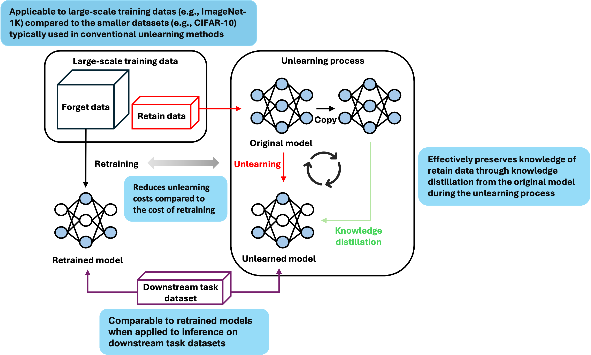

# Rethinking Unlearning for Transfer Learning

Official PyTorch implementation of Rethinking Unlearning for Transfer Learning.

## Table of Contents

- [Introduction](#introduction)
- [Features](#features)
- [Requirements](#requirements)
- [Datasets Preparation](#datasets-preparation)
- [Training and Unlearning](#training-and-unlearning)
- [Evaluation](#evaluation)
- [Acknowledgements](#acknowledgements)
- [Citation](#citation)
- [License](#license)
- [Contact](#contact)

## Introduction

Machine unlearning (MU) has become a critical area of research due to data regulations like GDPR, addressing the trustworthiness and safety of AI foundation models. These models, trained on vast web data, often raise privacy and copyright concerns. While existing MU methods mainly target smaller datasets (e.g., CIFAR-10, MNIST), their impact on transfer learning(commonly used in large-scale models) remains underexplored. Our study investigates the practical effects of MU methods on transfer learning. We apply unlearning techniques to forget selected classes on ImageNet pre-trained models and evaluate their classification accuracy using k-nearest neighbors on the Office-Home dataset, comparing unlearned models with retrained models.

<p align="center"></p>

## Features

- **Machine Unlearning**: Focuses on efficiently removing specific data or knowledge from trained AI models while minimizing performance degradation, ensuring adaptability for real-world applications and compliance with regulatory requirements.
- **Privacy-Compliant**: Implements machine unlearning to comply with data regulations like GDPR by addressing privacy and copyright concerns.
- **Scalable Unlearning**: Adapts unlearning methods to foundation models and large-scale datasets beyond smaller benchmarks like CIFAR-10 and MNIST.
- **Transfer Learning Evaluation**: Measures the impact of unlearning on transfer learning using k-nearest neighbors across downstream tasks.
- **Comparative Analysis**: Compares unlearned models with retrained models for classification accuracy, k-nearest neighbors and CKA ensuring practical insights.

## Requirements

```bash
cd unlearning
conda env create -f env.yaml
conda activate unlearning
```

## Datasets Preparation

All datasets used in our experiments are publicly available.

1. Download the [ImageNet-1k dataset](https://image-net.org/download.php). You need to register and request access to the dataset for downloading. Once approved, you can obtain the training and validation data.
2. Place the dataset in the "/home/dataset/" directory to match the expected path. Alternatively, you can specify a custom path using the --data_dir argument:
```bash
--data_dir ${path of the imagenet dataset}
```

## Training and Unlearning

1. Get the origin model.
```bash
python main_train.py --dataset ${dataset} --data_dir ${path of the imagenet dataset} --arch ${model architechture} --imagenet_arch --save_dir ${file to save the orgin model} --epochs ${epochs for training} --lr ${learning rate for training}
```

A simple example for ResNet-50 on ImageNet.
```bash
python main_train.py --dataset imagenet --data_dir ${path of the imagenet dataset} --arch resnet50 --imagenet_arch --save_dir ./result --lr 0.1 --epochs 182
```

2. Generate saliency map (If you want to use SalUn).
```bash
python generate_mask.py --save_dir ${saliency_map_path} --model_path ${original model path} --class_to_replace ${classes to forget} --unlearn_epochs 1
```

A simple example to generate saliency map for ResNet-50 on ImageNet.
```bash
python generate_mask.py --dataset imagenet --data_dir ${path of the imagenet dataset}  --arch resnet50 --imagenet_arch --save_dir ./mask --model_path ./pretrained_model/original.pth.tar --unlearn_epochs 1
```

3. Unlearn the original model.
* Our method
```bash
python main_forget.py --dataset imagenet --data_dir ${path of the imagenet dataset} --num_classes 1000 --arch resnet50 --imagenet_arch --save_dir ${save_dir} --model_path ${original model path} --unlearn SPKD --class_to_replace ${classes to forget, refer to the class_to_replace folder} --unlearn_epochs ${epochs for unlearning} --unlearn_lr ${learning rate for unlearning}
```

A simple example for unlearning using GA_SPKD, GA_RKD and GA_AKD.
```bash
python main_forget.py --dataset imagenet --data_dir ${path of the imagenet dataset} --num_classes 1000 --arch resnet50 --imagenet_arch --save_dir ./result/ --model_path ${original model path} --unlearn SPKD --unlearn_epochs 15 --unlearn_lr 1e-5 --batch_size 128
```
```bash
python main_forget.py --dataset imagenet --data_dir ${path of the imagenet dataset} --num_classes 1000 --arch resnet50 --imagenet_arch --save_dir ./result/ --model_path ${original model path} --unlearn RKD --unlearn_epochs 15 --unlearn_lr 1e-5 --batch_size 128
```
```bash
python main_forget.py --dataset imagenet --data_dir ${path of the imagenet dataset} --num_classes 1000 --arch resnet50 --imagenet_arch --save_dir ./result/ --model_path ${original model path} --unlearn AKD --unlearn_epochs 15 --unlearn_lr 1e-5 --batch_size 128
```

* GA with Knowledge Distillation
```bash
python main_forget.py --dataset imagenet --data_dir ${path of the imagenet dataset} --num_classes 1000 --arch resnet50 --imagenet_arch --save_dir ${save_dir} --model_path ${original model path} --unlearn GAwithKD --class_to_replace ${classes to forget} --unlearn_epochs ${epochs for unlearning} --unlearn_lr ${learning rate for unlearning}
```

* Retrain
```bash
python main_forget.py --dataset imagenet --data_dir ${path of the imagenet dataset} --num_classes 1000 --arch resnet50 --imagenet_arch --save_dir ${save_dir} --model_path ${original model path} --unlearn retrain --class_to_replace ${classes to forget} --unlearn_epochs ${epochs for unlearning} --unlearn_lr ${learning rate for unlearning}
```

* FT
```bash
python main_forget.py --dataset imagenet --data_dir ${path of the imagenet dataset} --num_classes 1000 --arch resnet50 --imagenet_arch --save_dir ${save_dir} --model_path ${original model path} --unlearn FT --class_to_replace ${classes to forget} --unlearn_epochs ${epochs for unlearning} --unlearn_lr ${learning rate for unlearning}
```

* GA
```bash
python main_forget.py --dataset imagenet --data_dir ${path of the imagenet dataset} --num_classes 1000 --arch resnet50 --imagenet_arch --save_dir ${save_dir} --model_path ${original model path} --unlearn GA --class_to_replace ${classes to forget} --unlearn_epochs ${epochs for unlearning} --unlearn_lr ${learning rate for unlearning}
```

* l1-sparse
```bash
python -u main_forget.py --dataset imagenet --data_dir ${path of the imagenet dataset} --num_classes 1000 --arch resnet50 --imagenet_arch --save_dir ${save_dir} --model_path ${original model path} --unlearn FT_prune --class_to_replace ${classes to forget} --alpha ${alpha} --unlearn_epochs ${epochs for unlearning} --unlearn_lr ${learning rate for unlearning}
```

* SalUn
```bash
python main_forget.py --dataset imagenet --data_dir ${path of the imagenet dataset} --num_classes 1000 --arch resnet50 --imagenet_arch --save_dir ${save_dir} --model_path ${original model path} --unlearn RL_imagenet --class_to_replace ${classes to forget} --unlearn_epochs ${epochs for unlearning} --unlearn_lr ${learning rate for unlearning} --mask_path ${saliency_map_path}
```

## Evaluation

To enable evaluation and tracking of the unlearned model using WandB, include the following flags when running your script:
```bash
--use_wandb --wandb_name ${project name}
```

Evaluate unlearned model using kNN and CKA(Centered Kernel Alignment) on Office-Home dataset. Include flags --evaluate_knn and --evaluate_cka to evaluate the unlearned model. To evaluate CKA, you need to set the path of the retrained model and the path of the office-home, CUB, DomainNet126 dataset.
```bash
--evaluate_knn

--evaluate_cka --retrained_model_path ${path of the retrained model} --office_home_dataset_path ${path of the office-home dataset} --cub_dataset_path ${path of the cub dataset} --domainnet_dataset_path ${path of the domainnet dataset} --class_to_replace ${classes to forget}
```

Evalaute unlearned model using kNN and CKA on Office-Home, CUB, DomainNet126 dataset.
```bash
python main_eval.py --dataset imagenet --data_dir ${path of the imagenet dataset} --arch ${model architechture} --imagenet_arch --office_home_dataset_path ${path of the office-home dataset} --cub_dataset_path ${path of the cub dataset} --domainnet_dataset_path ${path of the domainnet dataset} --model_path ${path of the unlearned model for evaluation} --retrained_model_path ${path of the retrained model} --batch_size 512 --class_to_replace ${classes to forget}
```

## Acknowledgements

Our source code is modified and adapted on these great repositories:

- [SalUn: Empowering Machine Unlearning via Gradient-based Weight Saliency in Both Image Classification and Generation](https://github.com/OPTML-Group/Unlearn-Saliency)

## Citation

If you find this repository helpful in your research, please cite:

```bibtex
@inproceedings{-,
    title={},
    author={},
    booktitle={},
    year={},
  }
```

## License

This project is licensed under the terms of the MIT license.

## Contact

For any questions, please reach out to:

- **Youngkyun Kim**: [ygkim08@korea.ac.kr](mailto:ygkim08@korea.ac.kr)
- **Yongwoo Kim**: [yongwookim@korea.ac.kr](mailto:yongwookim@korea.ac.kr)

We appreciate your interest in our work.
