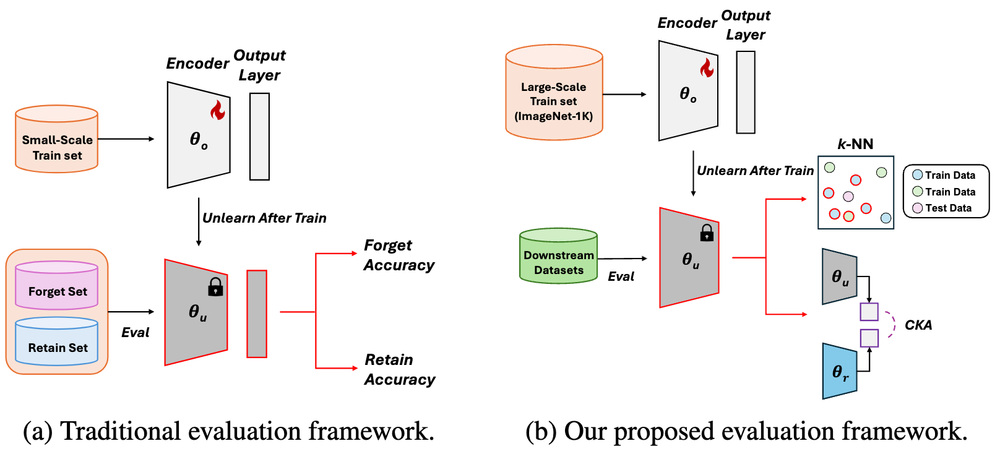

# Are We Truly Forgetting? A Critical Re-examination of Machine Unlearning Evaluation Protocols

Official PyTorch implementation

## Table of Contents

- [Introduction](#introduction)
- [Features](#features)
- [Requirements](#requirements)
- [Datasets Preparation](#datasets-preparation)
- [Evaluation](#evaluation)
- [Acknowledgements](#acknowledgements)
- [Citation](#citation)
- [License](#license)
- [Contact](#contact)

## Introduction

Machine unlearning is a process to remove specific data points from a trained model while maintaining the performance on retain data, addressing privacy or legal requirements. Despite its importance, existing unlearning evaluations tend to focus on logit-based metrics (*i.e.*, accuracy) under small-scale scenarios. We observe that this could lead to a false sense of security in unlearning approaches under real-world scenarios. In this paper, we conduct a new comprehensive evaluation that employs representation-based evaluations of the unlearned model under large-scale scenarios to verify whether the unlearning approaches genuinely eliminate the targeted forget data from the model's representation perspective. Our analysis reveals that current state-of-the-art unlearning approaches either completely degrade the representational quality of the unlearned model or merely modify the classifier (*i.e.*, the last layer), thereby achieving superior logit-based evaluation metrics while maintaining significant representational similarity to the original model. Furthermore, we introduce a novel unlearning evaluation setup from a transfer learning perspective, in which the forget set classes exhibit semantic similarity to downstream task classes, necessitating that feature representations diverge significantly from those of the original model. Our comprehensive benchmark not only addresses a critical gap between theoretical machine unlearning and practical scenarios, but also establishes a foundation to inspire future research directions in developing genuinely effective unlearning methodologies.

<p align="center"></p>

## Features

- **Machine Unlearning**: Focuses on efficiently removing specific data or knowledge from trained AI models while minimizing performance degradation, ensuring adaptability for real-world applications and compliance with regulatory requirements.
- **Privacy-Compliant**: Implements machine unlearning to comply with data regulations like GDPR by addressing privacy and copyright concerns.
- **Scalable Unlearning**: Adapts unlearning methods to foundation models and large-scale datasets beyond smaller benchmarks like CIFAR-10 and MNIST.
- **Transfer Learning Evaluation**: Measures the impact of unlearning on transfer learning using k-nearest neighbors across downstream tasks.
- **Comparative Analysis**: Compares unlearned models with retrained models for classification accuracy, k-nearest neighbors and CKA ensuring practical insights.

## Requirements

```bash
cd unlearning
conda env create -f env.yaml
conda activate unlearning
```

## Datasets Preparation

All datasets used in our experiments are publicly available.

1. Download the [ImageNet-1k dataset](https://image-net.org/download.php). You need to register and request access to the dataset for downloading. Once approved, you can obtain the training and validation data.
2. Place the dataset in the "/home/dataset/" directory to match the expected path. Alternatively, you can specify a custom path using the --data_dir argument:
```bash
--data_dir ${path of the imagenet dataset}
```

## Evaluation

Evalaute the unlearned model using *k*-NN and CKA on Office-Home, CUB, DomainNet126 dataset.
```bash
python main_eval.py --dataset imagenet --data_dir ${path of the imagenet dataset} --arch ${model architechture} --imagenet_arch --office_home_dataset_path ${path of the office-home dataset} --cub_dataset_path ${path of the cub dataset} --domainnet_dataset_path ${path of the domainnet dataset} --model_path ${path of the unlearned model for evaluation} --retrained_model_path ${path of the retrained model} --batch_size 512 --class_to_replace ${classes to forget}
```

## Acknowledgements

Our source code is modified and adapted on these great repositories:

- [SalUn: Empowering Machine Unlearning via Gradient-based Weight Saliency in Both Image Classification and Generation](https://github.com/OPTML-Group/Unlearn-Saliency)

## Citation

If you find this repository helpful in your research, please cite:

```bibtex
@article{kim2025we,
  title={Are we truly forgetting? a critical re-examination of machine unlearning evaluation protocols},
  author={Kim, Yongwoo and Cha, Sungmin and Kim, Donghyun},
  journal={arXiv preprint arXiv:2503.06991},
  year={2025}
}
```

## License

This project is licensed under the terms of the MIT license.

## Contact

For any questions, please reach out to:

- **Yongwoo Kim**: [yongwookim@korea.ac.kr](mailto:yongwookim@korea.ac.kr)

We appreciate your interest in our work.
