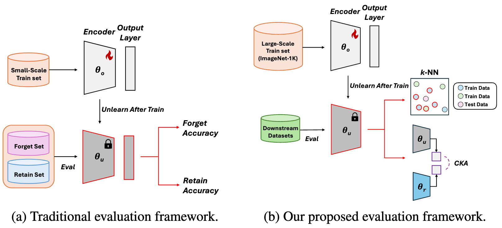

# Are We Truly Forgetting? A Critical Re-examination of Machine Unlearning Evaluation Protocols

[](https://arxiv.org/abs/2503.06991)

## Table of Contents

- [Introduction](#introduction)
- [Features](#features)
- [Requirements](#requirements)
- [Datasets Preparation](#datasets-preparation)
- [Pretrained Models](#pretrained-models)
- [Evaluation](#evaluation)
- [Acknowledgements](#acknowledgements)
- [Citation](#citation)
- [License](#license)
- [Contact](#contact)

## Introduction

We present a comprehensive benchmark for evaluating machine unlearning under large-scale, realistic scenarios. While prior works have primarily relied on logit-based metrics (*e.g.*, classification accuracy) in small-scale settings, our framework focuses on representation-level evaluation to assess whether unlearning methods truly remove the influence of target data. We find that existing methods often either degrade representation quality or only modify the classifier layer, leaving core representations unchanged. To address this, we introduce a transfer learning-based evaluation setup where forget classes are semantically aligned with downstream tasks, posing a more rigorous challenge. Our benchmark exposes critical limitations of current approaches and provides a solid foundation for developing and evaluating truly effective unlearning algorithms.

<p align="center"></p>

## Features

- **Machine Unlearning**: Focuses on efficiently removing specific data or knowledge from trained AI models while minimizing performance degradation, ensuring adaptability for real-world applications and compliance with regulatory requirements.
- **Privacy-Compliant**: Implements machine unlearning to comply with data regulations like GDPR by addressing privacy and copyright concerns.
- **Scalable Unlearning**: Adapts unlearning methods to large-scale datasets beyond smaller benchmarks like CIFAR-10 and MNIST.
- **Transfer Learning Evaluation**: Measures the impact of unlearning on transfer learning perspective using k-nearest neighbors across downstream tasks.
- **Comparative Analysis**: Compares unlearned models with retrained models for classification accuracy, k-nearest neighbors and CKA ensuring practical insights.

## Requirements

```bash
git clone https://github.com/yongwookim1/UUEF.git
cd UUEF
conda env create -f env.yaml
conda activate UUEF
```

## Datasets Preparation

All datasets used in our evaluation framework are publicly available.

1. Download the [ImageNet-1K dataset](https://image-net.org/download.php). You need to register and request access to the dataset for downloading. Once approved, you can obtain the training and validation data.
2. Place the dataset in the "/home/dataset/" directory to match the expected path. Alternatively, you can specify the custom path using the --data_dir argument:
```bash
--data_dir ${path of the imagenet dataset}
```
3. Download the [Office-Home dataset](https://www.hemanthdv.org/officeHomeDataset.html).
4. Download the [CUB dataset](https://www.kaggle.com/datasets/wenewone/cub2002011).
5. Download the [DomainNet dataset](https://ai.bu.edu/M3SDA/#dataset).
6. Place the datasets in the "/home/dataset/" directory to match the expected path. Alternatively, you can specify the custom path using arguments:
```bash
--office_home_dataset_path ${path of the office-home dataset} --cub_dataset_path ${path of the cub dataset} --domainnet_dataset_path ${path of the domainnet dataset}
```

## Pretrained Models

Training is outside the scope of this work; we provide the model weight files for evaluation.

Put these sample models in pretrained_model directory.

Path of the original model: https://drive.google.com/file/d/1VSLAeZnZ1O-EcybBH1Bo4B8m3pqrVyCg/view?usp=drive_link
(The original model is required for evaluation)

Path of the retrained model: https://drive.google.com/file/d/1OQIe5IgLec6SCuwhN05HtSEGYlggJZVc/view?usp=sharing

```bash
pip install gdown
mkdir -p pretrained_model
gdown --id 1VSLAeZnZ1O-EcybBH1Bo4B8m3pqrVyCg -O pretrained_model/original_model.pth.tar
gdown --id 1OQIe5IgLec6SCuwhN05HtSEGYlggJZVc -O pretrained_model/retrained_model.pth.tar
```

## Evaluation

Evaluate the unlearned model using *k*-NN and CKA on Office-Home, CUB, DomainNet126 dataset.
```bash
python main_eval.py \
--dataset imagenet \
--data_dir ${path of the imagenet dataset} \
--arch ${model architecture} \
--imagenet_arch \
--office_home_dataset_path ${path of the office-home dataset} \
--cub_dataset_path ${path of the cub dataset} \
--domainnet_dataset_path ${path of the domainnet dataset} \
--model_path ${path of the unlearned model for evaluation} \
--retrained_model_path ${path of the retrained model} \
--batch_size 512 \
--class_to_replace ${classes to forget}
```

A simple example using given models is here.
```bash
python main_eval.py \
--dataset imagenet \
--data_dir ${path of the imagenet dataset} \
--arch resnet50 \
--imagenet_arch \
--office_home_dataset_path ${path of the office-home dataset} \
--cub_dataset_path ${path of the cub dataset} \
--domainnet_dataset_path ${path of the domainnet dataset} \
--model_path pretrained_model/unlearned_model_CU \
--retrained_model_path pretrained_model/retrained_model \
--batch_size 512 \
--class_to_replace random100
```

## Acknowledgements

Our source code is modified and adapted on these great repositories:

- [SalUn: Empowering Machine Unlearning via Gradient-based Weight Saliency in Both Image Classification and Generation](https://github.com/OPTML-Group/Unlearn-Saliency)

## Citation

If you find this repository helpful in your research, please cite:

```bibtex
@article{kim2025we,
  title={Are we truly forgetting? a critical re-examination of machine unlearning evaluation protocols},
  author={Kim, Yongwoo and Cha, Sungmin and Kim, Donghyun},
  journal={arXiv preprint arXiv:2503.06991},
  year={2025}
}
```

## License

This project is licensed under the terms of the MIT license.

## Contact

For any questions, please reach out to:

- **Yongwoo Kim**: [yongwookim@korea.ac.kr](mailto:yongwookim@korea.ac.kr)

We appreciate your interest in our work.
